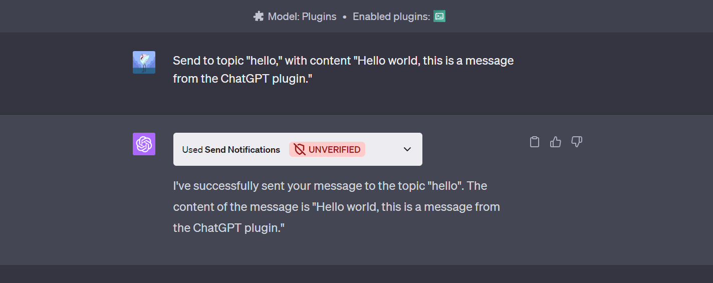

# Send Notifications ChatGPT Plugin

Send Notifications ChatGPT Plugin is a plugin for OpenAI's ChatGPT that allows users to send notifications to any topic via ntfy.sh.

## Features

- Send notifications to any topic via ntfy.sh.
- No collection or storage of personal data.

## Installation

To install the Send Notifications ChatGPT Plugin, follow these steps:

1. Download the plugin from the [GitHub repository](https://github.com/jlvihv/send-notifications-chatgpt-plugin).
2. Follow the instructions provided by OpenAI for installing and using plugins with ChatGPT.

## Usage

To use the Send Notifications ChatGPT Plugin, you need to send a notification to a specific topic. The plugin will handle the rest.

## Privacy

This plugin does not collect or store any personal data. For more information, please see the [Privacy Policy](https://github.com/jlvihv/send-notifications-chatgpt-plugin/blob/main/PRIVACY.md).

## License

This project is licensed under the terms of the MIT license.

## Contact

If you have any questions, suggestions, or issues, please don't hesitate to contact me at imvihv@gmail.com.
